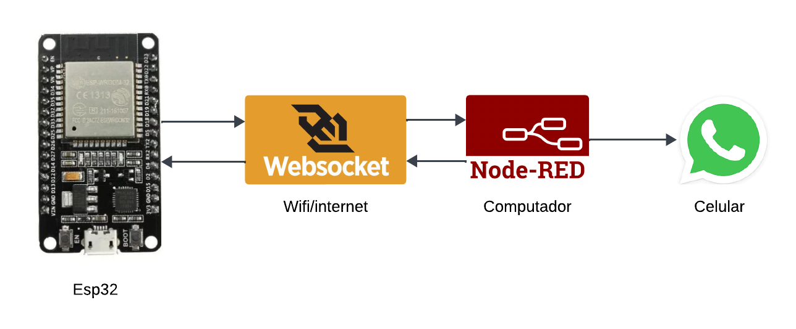

# Security Alarm via WhatsApp
Embedded Systems IoT Course

**Motivation**

- Insecurity regarding the protection of your home

**Objective**

- A system that provides monitoring of your house in an accessible manner and communicates with you in real-time through something that is always in your sight: your mobile device.
- 
 
